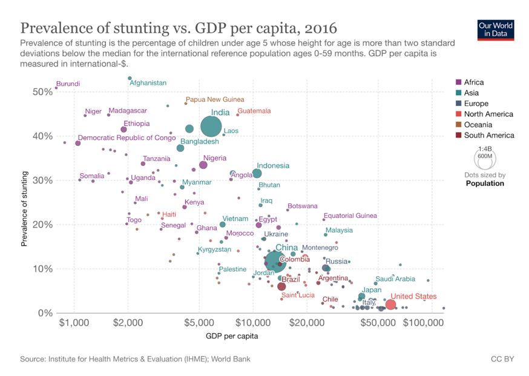
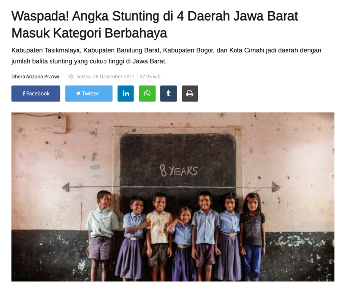
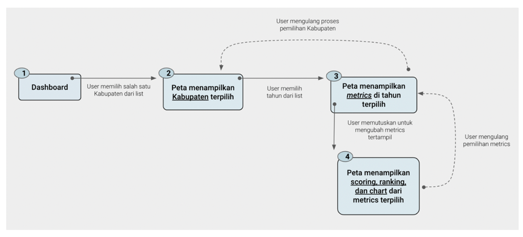
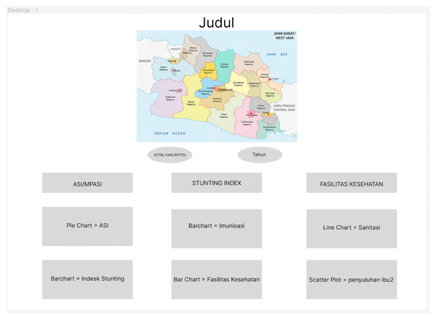
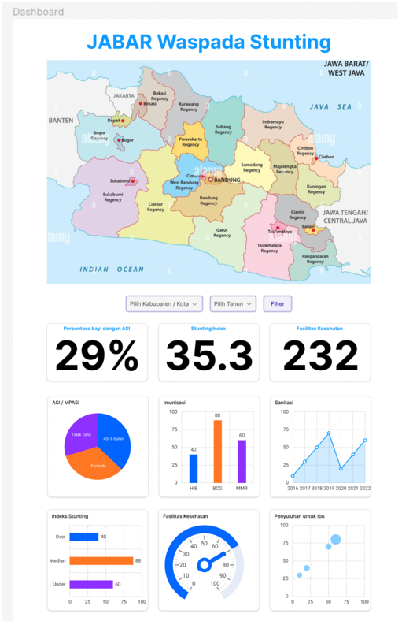
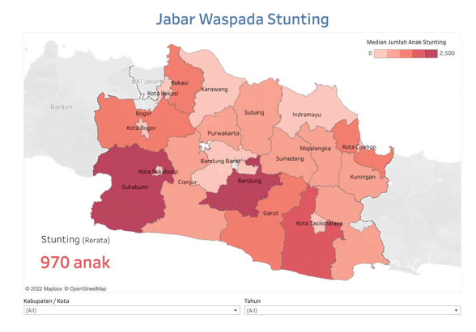
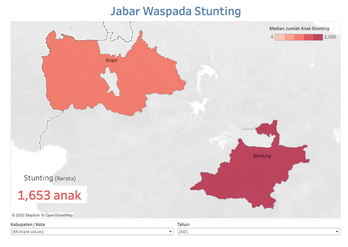
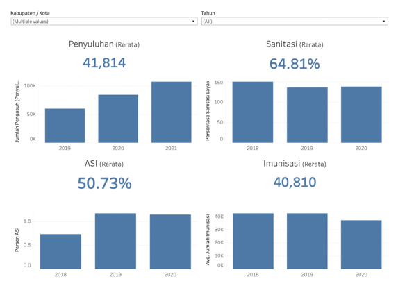

# Final project lab BI Pacmann Group P
> Hanief Utama, Haryo Baskoro, Aditya Arie W

##  LATAR BELAKANG MASALAH
Berdasarkan pada data dari berbagai negara dunia dalam kurun waktu 26 tahun (1990-2016), tingginya persentase stunting yang terjadi di suatu negara berkorelasi terhadap rendahnya  ekspektasi GDP pada negara tersebut, dan Indonesia tidak terkecuali.



[Our World in Data](https://ourworldindata.org/grapher/stunting-ihme-vs-gdp?time=earliest)

Provinsi merupakan komponen utama dari suatu negara, sehingga tidak heran apabila tingginya nilai stunting suatu negara dapat dimaknai dengan akan tingginya jumlah stunting provinsi tersebut. Daerah Jawa Barat merupakan salah satu provinsi dengan angka stunting cukup tinggi (masuk kategori berbahaya). 



[Source](https://akurat.co/waspada-angka-stunting-di-4-daerah-jawa-barat-masuk-kategori-berbahaya)

Kami menganggap, perihal tingginya nilai stunting tidak hanya mengancam terhambatnya tumbuhkembang anak-anak, namun juga berdampak negatif terhadap potensi perkembangan pendapatan daerah (keekonomian) tersebut. Secara general terhambatnya pertumbuhan juga berpotensi pada perlambatan motorik, kecerdasan anak, sehingga potensi sumber daya manusia di daerah tersebut juga akan terhambat. 

Studi ini berusaha menjawab dua aspek penting dalam penanganan stunting di daerah Jabar, yakni pengawasan dan penanganan tepat guna. Dua hal yang menjadi landasan masalah adalah:

1. PemProv Jabar memiliki kesulitan dalam mengawasi tingkat stunting (gizi buruk pada anak di bawah 5 tahun) pada tiap wilayah kabupaten. 

2. PemProv dan Pihak Swasta sangat memiliki kepentingan untuk menurunkan jumlah stunting demi memastikan potensi SDM dan GDP di daerah Jabar dapat tumbuh tinggi di masa depan.


### TUJUAN MASALAH
Berdasarkan pada latar belakang masalah, ada beberapa aspek yang harus dijawab oleh produk studi ini yakni, berapa angka stunting di tiap daerah dalam provinsi jabar (kabupaten), dan bagaimana kondisi metrik-metrik penting terkait dengan potensi stunting ini (ASI, Penyuluhan, dll). 

Ada tiga persona yang dapat ditarik dari studi ini yakni:
Pemerintah Provinsi Jabar 

1. **Pihak pemerintah** memiliki kepentingan untuk melakukan pengawasan dan memastikan kebijakan publik yang telah dan sedang dibuat dapat berdampak positif terhadap penurunan jumlah stunting di daerah Jabar. Persona ini memiliki waktu yang terbatas untuk melihat data. 

2. **Pihak Swasta/Investor** dalam hal ini juga memiliki kepentingan untuk memastikan bahwa pemerintah serius dalam menangani stunting demi memastikan iklim investasi yang kondusi dalam 10 tahun ke depan. Persona ini juga memiliki waktu terbatas dalam melihat data.

3. **Pihak Peneliti** memiliki kepentingan yang lebih menyentuh level masyarakat, dengan memastikan jalannya kebijakan-kebijakan, bantuan sosial, demi menurunkan angka stunting ini benar-benar tepat guna. Persona ini memiliki waktu yang panjang dalam melihat data. 

## PROSES PENGERJAAN
### Pengumpulan Data
Dashboard tampilan provinsi Jawa Barat yang terpisah berdasarkan kelurahan, sehingga data pertama yang harus didapatkan adalah data shapefile/ multipolygon untuk membuat peta sebaran. Data shapefile untuk studi ini diambil dari GADM website. 

Kemudian, data yang akan menjadi features dalam sebaran peta menggunakan data dari website open data jabar. Terdapat enam  data utama yang dipakai dalam studi ini adalah sebagai berikut:

1. ASI dan MPASI
2. Imunisasi
3. Sanitasi
4. Jumlah stunting
1. Ketersediaan Faskes
1. Penyuluhan Orangtua

### Exploratory Data Analysis (EDA)
Setiap data dicek dan dilakukan exploratory data analysis (EDA) untuk merapihkan data, melakukan wrangling yang dibutuhkan sebelum dipakai untuk membuat peta sebaran features. 

Beberapa EDA dan Data Wrangling yang umum dilakukan adalah sebagai berikut:

- Merubah nama kolom agar lebih deskriptif, ini dilakukan terutama pada data shapefile peta Jabar. 
```
new_name = {
    'NAME_1': 'propinsi',
    'NAME_2': 'nama_kabupaten',
    'TYPE_2': 'tipe_admin',
    'CC_2': 'kode_kabupaten' ,
    'geometry': 'geometri',
}

jabar_map = jabar_map.rename(columns=new_name)

```
- Beberapa data seperti ASI memiliki outlier dimana nilai persentase di atas 100%.
```
#clipping persentase_pemberian_asi above 100%

asi['persentase_pemberian_asi'] = asi['persentase_pemberian_asi'].clip(0,100)
asi.describe()
```

- Merubah nama kabupaten menjadi “title”, dan mengganti nama Kota Banjar menjadi Banjar agar sesuai dengan data peta shapefile. 
```
asi.nama_kabupaten_kota.str.title().replace({'Kota Banjar': 'Banjar'})

```
Penjelasan dan proses EDA lebih detail dapat ditemukan dalam repository github: 


### User Flow
Proses user dijabarkan dengan akses utama ke dashboard, kemudian melakukan pemilihan region/ kabupaten dari peta sebaran stunting. User juga kemudian dapat melakukan filtering berdasarkan tahun, kabupaten-kabupaten (lebih dari dua), dan melihat metrik-metrik relevan terkait stunting. 



Dengan proses ini, user dapat dengan cepat memantau jumlah stunting tiap kabupaten di Jabar, dan melihat relevansinya terhadap metrik-metrik seperti ASI, Imunisasi, untuk memutuskan mana yang lebih memerlukan penanganan. Misalnya, di Kabupaten Banjar, nilai stunting yang tinggi lebih disebabkan oleh rendahnya nilai ASI, sedangkan faktor lain seperti Imunisasi, Sanitasi dan lain-lain masih dianggap wajar. User dapat langsung memutuskan menggalakkan ASI di daerah tersebut.

### Lo-Fi Prototype
Prototype awal (Lo-fi) menggunakan gambar peta Jabar dan beberapa frame-frame utama terkait gambaran umum dashboard yang ingin dibuat nantinya di Hi-fi prototype. 



### Hi-Fi Prototype
Prototype lanjutan lebih mengarah ke aspek riil dashboard berupa chart dan diagram yang ingin ditampilkan sebagai komponen utama dashboard. 



## MVP Demo
Pada dasarnya dashboard ini terdiri atas tiga komponen utama, yakni Peta, FIlter dan Bar Chart. [Link Dashboard](https://public.tableau.com/app/profile/haniefutama/viz/JabarWaspadaStunting/StuntingDashboard)



### Peta dan Filter 
Pada bagian Peta, komponen yang digambarkan adalah jumlah stunting pada tiap kabupaten yang langsung dapat dipilih dengan meng-klik pada peta, atau bisa juga memilih dari drop-down filter Kabupaten. Dalam tampilan default user akan disajikan keseluruhan kabupaten seperti terlampir di bawah. 

Penggunaan warna menggunakan warna sekuensial, sehingga semakin tinggi jumlah anak stunting maka akan semakin “merah” pula warna peta. Legenda warna peta ditampilkan pada pojok kanan atas peta. Selain menggunakan warna, jumlah rerata anak yang stunting dari data terpilih juga disajikan dalam bentuk angka pada pojok kiri bawah peta.

Selain filter kabupaten, user juga dapat memilih tahun tertentu dari filter Tahun yang terdiri atas tiga tahun survey (2019-2020-2021). Setelah dilakukan pemilihan daerah/ kabupaten dan tahun, maka statistik rerata dari anak stunting akan ter-update dan berubah menyesuaikan dengan rerata kabupaten terpilih. Sebagai contoh di bawah disajikan rerata Kabupaten Bogor dan Bandung dengan angka rerata sedikit di atas  seribu enam ratus anak. 



### Metrik dan Diagram
Di bawah peta sebaran stunting, terdapat empat metrik utama yang terbagi menjadi dua kolom dan baris, yakni: penyuluhan dan sanitasi pada baris pertama, lalu ASI dan imunisasi pada baris kedua. Keempat metrik ini dianggap berkaitan langsung dengan tingginya nilai stunting. 



Nilai yang ditampilkan (jumlah rerata) akan mengikuti data terpilih dari sub-chapter sebelumnya (Peta dan Filter). 
Diagram bar dipilih untuk membantu user melihat tren dari tiap metrik di tiap daerah per tahunnya. Dengan fitur ini, user dapat dengan cepat melihat kabupaten mana yang memiliki tren memburuk dari metrik tertentu. Sebagai contoh, imunisasi terlihat mengalami penurunan jumlah anak di tahun 2020, dibandingkan dua tahun sebelumnya. 

## ANALISIS & KESIMPULAN
Berdasarkan pada dashboard di atas, beberapa aspek masalah yang ingin dijawab sudah dapat dijawab sebagai berikut:
1. Aspek Pengawasan 
User dapat menggunakan peta untuk melihat secara cepat, daerah/ kabupaten mana yang memiliki status darurat terkait jumlah anak stunting. Sebagai contoh, dari peta, dapat terlihat daerah kabupaten seperti Sukabumi, Bandung, dan Tasikmalaya termasuk dalam tiga besar daerah dengan jumlah anak stunting tertinggi. 
1. Aspek Kebijakan Tepat Guna
User kemudian dapat melihat dari beberapa metrik yang disajikan, metrik apa yang kemungkinan besar berpengaruh terhadap naiknya jumlah anak stunting di daerah tersebut. Sebagai contoh pada gambar sebelumnya, kabupaten Bandung dan Bogor memiliki penurunan tren pada tingkat imunisasi dan sanitasi yang bisa jadi berpotensi menghambat penurunan jumlah stunting. 
